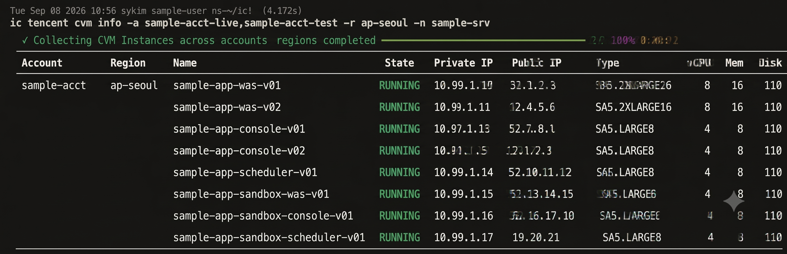

# Tencent Cloud Services Guide

IC CLI provides comprehensive, production-grade management for **Tencent Cloud** resources.

## 🖥️ Terminal UI Preview

### CVM Instance Inspection (`ic tencent cvm info`)


---

## 📦 Supported Tencent Cloud Services

### 1. CVM (Cloud Virtual Machine)
- **Commands**:
  - `ic tencent cvm info`: List CVM instances across regions/accounts, displaying Instance ID, Name, State, CPU/Memory, Zone, Private/Public IPs, and attached Security Groups.
  - `ic tencent cvm desc`: Deep inspection of CVM instance attributes in tree, JSON, or YAML format with key filtering (`-k / --keys`, `-l / --list-keys`).

### 2. Lighthouse (Lightweight Application Server)
- **Command**: `ic tencent lighthouse info`
- **Features**: Query Lightweight server instances, blueprint/OS, status, and network configuration.

### 3. CLB (Cloud Load Balancer)
- **Commands**: 
  - `ic tencent clb info`: Inspect Load Balancers, listeners, rules, health check paths, and target instance health status.
  - `ic tencent clb traffic`: Query network bandwidth statistics (Client Input/Output Bandwidth Avg/Max in Mbps) and total data transfer over a given period (default: 7 days, `-d 30` for 30 days).
  - `ic tencent clb desc`: Detailed CLB configuration and listener/rule hierarchy inspection with dot-notation key filtering.

### 4. VPC & Networking
- **Commands**: `ic tencent vpc info`, `ic tencent nat info`
- **Features**: Inspect Virtual Private Clouds, Subnets, and NAT Gateways.

### 5. TKE (Tencent Kubernetes Engine)
- **Command**: `ic tencent tke info`
- **Features**: List TKE Kubernetes clusters, version, status, and node pool details.

### 6. Security Groups
- **Commands**: `ic tencent sg info`, `ic tencent sg info -o tree`
- **Features**: Ingress/Egress rule inspection and visual tree representation of security group relations.

### 7. Profile & Authentication Management
- **Command**: `ic tencent profile info`
- **Features**: Validate credentials stored in `~/.tencent/credentials` or `secrets.yaml`, including STS AssumeRole configuration.

---

## ⚙️ Configuration Example (`~/.tencent/credentials`)

```yaml
default:
  secret_id: "AKIDxxxxxxxxxxxxxxxxxxxxxxxx"
  secret_key: "xxxxxxxxxxxxxxxxxxxxxxxxxxxxxxxx"
  region: "ap-seoul"
```
